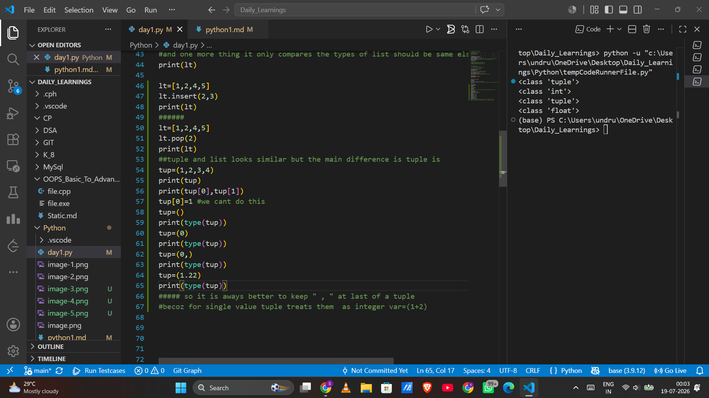

# Python Variables and `id()` Function
**Note:**
## Integers,Strings,Tuples are immutable
## List are mutable 
## t1=t1+t2 always creates a new list object ................


## **NOTE**
1. Most people are taught that x += y is just a shortcut for x = x + y. But in Python, that is a lie. They actually trigger two completely different behaviors under the hood when you are working with lists.

2. Here is the secret: += is specifically programmed to look at the object it's working with and ask, "Are you mutable?"

## How Python treats + vs +=
4. The + Operator (Strict Math)
When Python sees lt = lt + lt, the + operator has one strict rule: Never touch the originals. It creates a brand new list, copies the data over, and then the = sign moves the sticky note to the new list.

5. The += Operator (In-Place Addition)
The += operator is smarter. It is literally called "in-place addition."
When you use += on an immutable object (like a tuple or integer), Python realizes it can't modify it in-place, so it falls back to creating a new object.

But when you use += on a mutable object (like a list), Python says: "Great! I don't need to waste memory creating a new object. I will just reach into the existing list and shove the new data into it."

For lists, += acts exactly like the .extend() method!


## Code

```python
x = 2
y = x

print(id(x))
print(id(y))

y = 3

print(id(x))
print(id(y))
```

---

# What is `id()`?

The `id()` function returns the **unique memory address (identity)** of an object.

**Syntax**

```python
id(object)
```

It tells us **where the object is stored in memory**.

---

# Step-by-Step Explanation

## Step 1

```python
x = 2
```

- A Python integer object with value **2** is created (or reused if it already exists).
- Variable `x` points to that object.

```
x
 │
 ▼
+-----+
|  2  |
+-----+
```

---

## Step 2

```python
y = x
```

- No new object is created.
- `y` simply points to the **same object** as `x`.

```
x ──► +-----+
      |  2  |
y ──► +-----+
```

Both variables refer to the **same object**, so:

```python
print(id(x))
print(id(y))
```

Output:

```
2166489442640
2166489442640
```

The IDs are the same because both variables point to the same object.

---

## Step 3

```python
y = 3
```

Now `y` is assigned a new value.

Python creates (or reuses) the integer object `3`, and `y` starts pointing to it.

```
x ──► +-----+
      |  2  |

y ──► +-----+
      |  3  |
```

Notice that **`x` is not affected**.

---

## Step 4

```python
print(id(x))
print(id(y))
```

Output:

```
2166489442640
2166489442672
```

Now the IDs are different because:

- `x` points to the object `2`
- `y` points to the object `3`

---

# Why didn't `x` change?

When you write:

```python
y = 3
```

you are **not changing the object `2`**.

Instead, you are making `y` point to another object (`3`).

The object `2` remains unchanged, and `x` still points to it.

---

# Important Concept

Variables in Python **do not store values directly**.

They store **references (addresses)** to objects.

Example:

```python
a = 10
b = a
```

```
a ──► 10
b ──► 10
```

After:

```python
b = 20
```

```
a ──► 10
b ──► 20
```

Only `b` changes its reference.

---

# Memory Visualization

Initially:

```
x = 2
y = x

        +-----------+
x ─────►|     2     |
y ─────►+-----------+
```

After:

```python
y = 3
```

```
        +-----------+
x ─────►|     2     |
        +-----------+

        +-----------+
y ─────►|     3     |
        +-----------+
```

---

# Key Points

- `id()` returns the memory identity of an object.
- `x = 2` → `x` points to the object `2`.
- `y = x` → both `x` and `y` point to the same object.
- `y = 3` → `y` points to a new object (`3`).
- `x` still points to `2`.
- Variables store **references**, not the actual values.

---

# Output

```text
2166489442640
2166489442640
2166489442640
2166489442672
```

**Explanation:**

- First two IDs are the same because `x` and `y` refer to the same object (`2`).
- After `y = 3`, `y` refers to a different object, so its ID changes while `x`'s ID remains the same.

1. 
2. 

# How `and` Works

**Rule:**

- Return the **first falsy operand**.
- If **every operand is truthy**, return the **last operand**.

---

# How `or` Works

**Rule:**

- Return the **first truthy operand**.
- If **none are truthy**, return the **last operand**.


1. In minus indexing the values are like to be -5 , -4 ,-3 , -2 , -1 . here slicing is different like **"(]"**
3. Where as in normal indexing  the group looks like  this **"[)"**

**NOTE** :

# 4. Assignment vs Copy in Python Lists

## Assignment (`=`)

When we assign one list to another using the assignment operator (`=`), **Python does not create a new list**.

Instead, **both variables point to the same list object** in memory.

### Example

```python
list1 = [10, 20, 30]
list2 = list1

print(list1)
print(list2)
```

### Memory Diagram

```
list1
   \
    \
     -----> +----------------+
list2        | 10 | 20 | 30 |
             +----------------+
```

Both `list1` and `list2` point to the **same list object**.

---

## Modifying the List

If we modify the list using methods like:

- `append()`
- `pop()`
- `remove()`
- `insert()`
- `clear()`
- `sort()`
- `reverse()`

the **same list object** is modified.

### Example

```python
list1 = [10, 20, 30]
list2 = list1

list1.append(40)

print(list1)
print(list2)
```

### Output

```
[10, 20, 30, 40]
[10, 20, 30, 40]
```

### Memory Diagram

```
list1
   \
    \
     -----> +--------------------+
list2        |10|20|30|40|
             +--------------------+
```

Since both variables refer to the same object, both show the change.

---

## Creating an Independent Copy

If you want two different lists, you **must create a copy**.

The easiest way is:

```python
list2 = list1.copy()
```

or

```python
list2 = list(list1)
```

or

```python
list2 = list1[:]
```

### Example

```python
list1 = [10, 20, 30]
list2 = list1.copy()

list1.append(40)

print(list1)
print(list2)
```

### Output

```
[10, 20, 30, 40]
[10, 20, 30]
```

### Memory Diagram

```
list1 ----------> +--------------------+
                  |10|20|30|40|
                  +--------------------+

list2 ----------> +---------------+
                  |10|20|30|
                  +---------------+
```

Now the two variables point to **different list objects**, so changing one does not affect the other.

---

## Important Note

You **do not always need to use `copy()`**.

Use `copy()` **only when you want an independent list**.

If you intentionally want two variables to refer to the same list, then using the assignment operator (`=`) is correct.

---

## Summary

- `list2 = list1`
  - No new list is created.
  - Both variables point to the same list.
  - Any modification through one variable is visible through the other.

- `list2 = list1.copy()`
  - A new list is created.
  - Each variable points to a different list.
  - Changes to one list do not affect the other.