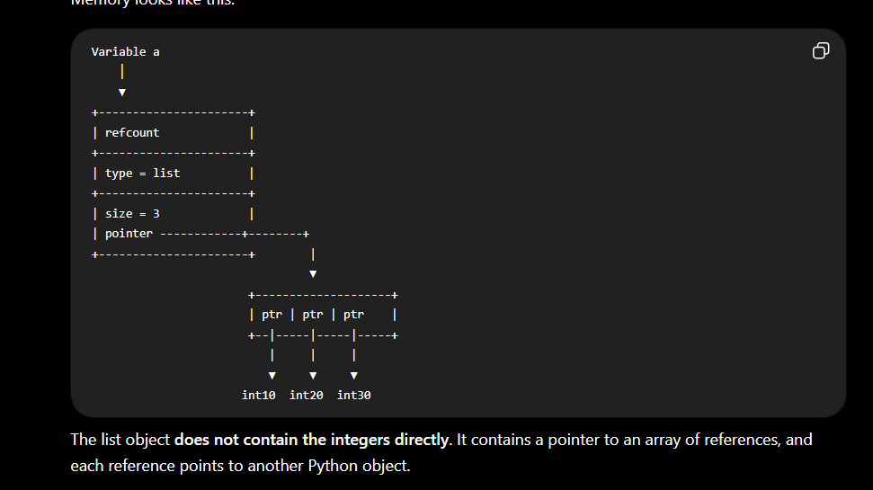
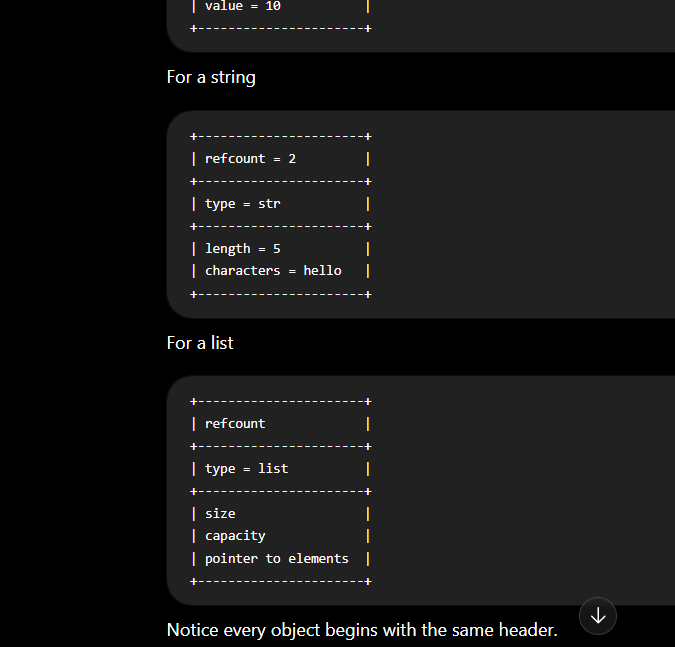
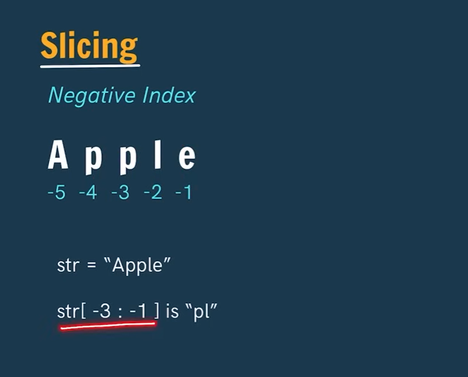

# Python Variables and `id()` Function

## Code

```python
x = 2
y = x

print(id(x))
print(id(y))

y = 3

print(id(x))
print(id(y))
```

---

# What is `id()`?

The `id()` function returns the **unique memory address (identity)** of an object.

**Syntax**

```python
id(object)
```

It tells us **where the object is stored in memory**.

---

# Step-by-Step Explanation

## Step 1

```python
x = 2
```

- A Python integer object with value **2** is created (or reused if it already exists).
- Variable `x` points to that object.

```
x
 │
 ▼
+-----+
|  2  |
+-----+
```

---

## Step 2

```python
y = x
```

- No new object is created.
- `y` simply points to the **same object** as `x`.

```
x ──► +-----+
      |  2  |
y ──► +-----+
```

Both variables refer to the **same object**, so:

```python
print(id(x))
print(id(y))
```

Output:

```
2166489442640
2166489442640
```

The IDs are the same because both variables point to the same object.

---

## Step 3

```python
y = 3
```

Now `y` is assigned a new value.

Python creates (or reuses) the integer object `3`, and `y` starts pointing to it.

```
x ──► +-----+
      |  2  |

y ──► +-----+
      |  3  |
```

Notice that **`x` is not affected**.

---

## Step 4

```python
print(id(x))
print(id(y))
```

Output:

```
2166489442640
2166489442672
```

Now the IDs are different because:

- `x` points to the object `2`
- `y` points to the object `3`

---

# Why didn't `x` change?

When you write:

```python
y = 3
```

you are **not changing the object `2`**.

Instead, you are making `y` point to another object (`3`).

The object `2` remains unchanged, and `x` still points to it.

---

# Important Concept

Variables in Python **do not store values directly**.

They store **references (addresses)** to objects.

Example:

```python
a = 10
b = a
```

```
a ──► 10
b ──► 10
```

After:

```python
b = 20
```

```
a ──► 10
b ──► 20
```

Only `b` changes its reference.

---

# Memory Visualization

Initially:

```
x = 2
y = x

        +-----------+
x ─────►|     2     |
y ─────►+-----------+
```

After:

```python
y = 3
```

```
        +-----------+
x ─────►|     2     |
        +-----------+

        +-----------+
y ─────►|     3     |
        +-----------+
```

---

# Key Points

- `id()` returns the memory identity of an object.
- `x = 2` → `x` points to the object `2`.
- `y = x` → both `x` and `y` point to the same object.
- `y = 3` → `y` points to a new object (`3`).
- `x` still points to `2`.
- Variables store **references**, not the actual values.

---

# Output

```text
2166489442640
2166489442640
2166489442640
2166489442672
```

**Explanation:**

- First two IDs are the same because `x` and `y` refer to the same object (`2`).
- After `y = 3`, `y` refers to a different object, so its ID changes while `x`'s ID remains the same.

1. 
2. 

# How `and` Works

**Rule:**

- Return the **first falsy operand**.
- If **every operand is truthy**, return the **last operand**.

---

# How `or` Works

**Rule:**

- Return the **first truthy operand**.
- If **none are truthy**, return the **last operand**.


1. In minus indexing the values are like to be -5 , -4 ,-3 , -2 , -1 . here slicing is different like **"(]"**
3. Where as in normal indexing  the group looks like  this **"[)"**